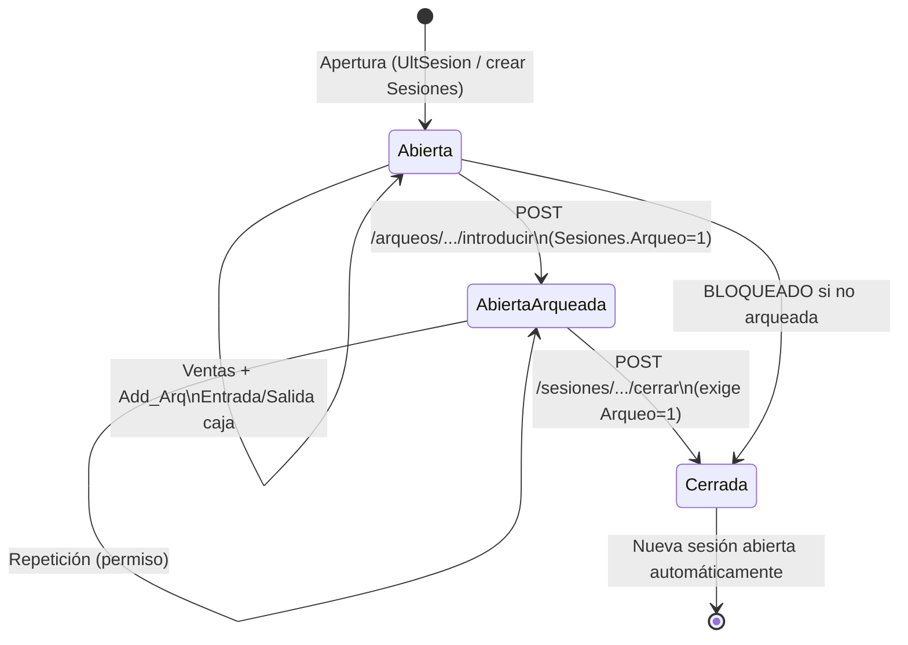

# Diseño: Arqueo operativo de caja (Descartes 2.0)

**Fecha**: 2026-08-04  
**Estado**: Fases 0–3 implementadas (Fase 3 = contrato + stubs de agente; drivers reales pendientes)  
**Origen**: Estudio legacy (`FrmArqueo`, `VentaGenerica\frmVenta`, `Ccc.bas`) + decisiones de producto  
**Relación**: Amplía US2/US3 de `002-ventas-gestion` (hoy solo consulta)

---

## 1. Decisiones de producto (acordadas)

| # | Decisión |
|---|----------|
| 1 | Alcance: ciclo operativo (situación → arqueo → cierre → entradas/salidas). Chef / `ArqueoCamarero` fuera. |
| 2 | `ArqueoCajaAntesCierre = S` (arquear sesión abierta; el cierre exige arqueo previo). |
| 3 | **Un solo sitio UI**: Gestión → Ventas → **Arqueo de caja**. Misma API para un futuro TPV. |
| 4 | Arqueo **no ciego** por defecto (se ven Acumulado, Entrado y diferencia). |
| 5 | Cajón electrónico: contrato API + agente local (fase posterior). |
| 6 | Impresión: pantalla + PDF ya; térmica vía agente local. |
| 7 | Permisos legacy mapeados a `RolPermisos`. |

Parámetros fijos de producto (no configurables en v1 salvo nota):

- `ArqueoCajaAntesCierre` = true  
- Arqueo ciego = false  
- Desglose monedas opcional al introducir efectivo (`Agrupacion = 0`)

---

## 2. Principio de arquitectura

```
┌─────────────────────┐     ┌──────────────────────────┐     ┌─────────────┐
│ Gestión Vue         │────►│ descartes-api            │────►│ SQL Server  │
│ /ventas/arqueo      │     │ ArqueoOperativoService   │     │ Sesiones    │
│ (única UI v1)       │     │ (+ Add_Arq desde ventas)  │     │ Arqueo      │
└─────────┬───────────┘     └────────────┬─────────────┘     │ Vales       │
          │                              │                   │ FormasPago  │
          │ opcional                     │                   │ Puestos     │
          ▼                              ▼                   └─────────────┘
┌─────────────────────┐     ┌──────────────────────────┐
│ Agente local puesto │◄────│ POST .../dispositivo/*   │
│ (cajón + térmica)   │     │ (contrato estable)       │
└─────────────────────┘     └──────────────────────────┘
```

- **Una lógica de negocio** en API.  
- La UI de Gestión es el único front en v1.  
- El TPV futuro solo consume los mismos endpoints.  
- Hardware (cajón / térmica) nunca se habla desde el navegador directamente.

---

## 3. Estados de sesión

### Diagrama



### Tabla de estados

| Estado | `Cerrada` | `Arqueo` | Qué se puede |
|--------|-----------|----------|--------------|
| **Abierta** | 0 | 0 | Situación, entrada/salida, **introducir arqueo**, no cerrar |
| **Abierta arqueada** | 0 | 1 | Situación, **repetir arqueo** (permiso), **cerrar**, no entrada/salida* |
| **Cerrada** | 1 | 0/1 | Solo consulta / reimpresión; no editar Entrado salvo política futura |

\* Entrada/salida tras arquear y antes de cerrar: **no permitir en v1** (evita descuadrar tras el recuento). Legacy a veces pide salida banco en el cierre; eso va **dentro** del POST cerrar, no como movimiento libre.

### Reglas duras (API)

1. Introducir arqueo solo si sesión existe y (`Cerrada=0` **o** modo legacy post-cierre desactivado — en v1 solo `Cerrada=0`).  
2. Si `Arqueo=1` y no hay permiso `repetir` → 409 + opción reimpresión.  
3. Cerrar solo si `Cerrada=0` y `Arqueo=1`.  
4. Si sesión sin movimientos ni efectivo → aviso (como legacy) y no cerrar “de verdad” o cerrar con confirmación explícita `forzar=true`.  
5. Formas en arqueo: `CobroDeArqueo=1` y `Agrupacion <> 3` (crédito excluido).  
6. Diferencia por línea: `Entrado − Acumulado`. Total diferencia = suma de formas que cuentan.

---

## 4. Pantallas (única UI: Gestión)

Sustituir / unificar las vistas actuales:

| Ruta actual | Destino |
|-------------|---------|
| `/ventas/arqueo` | **Hub operativo** (esta spec) |
| `/ventas/arqueo/desglose` | Pestaña o sección del hub (no menú separado a largo plazo; se puede mantener ruta redirect) |

### 4.1 Hub — cabecera

Selector:

- **Tienda** (`Empresa` / `EmpresaArqueo` del puesto)  
- **Puesto**  
- **Sesión** (por defecto: `Puestos.UltSesion` = abierta actual)

Cabecera de sesión (solo lectura):

- Fecha inicio / fin  
- Estado: Abierta | Arqueada | Cerrada  
- Cajero cierre / cajero arqueo  
- Contadores resumen: tickets, albaranes, facturas, entradas/salidas efectivo  

### 4.2 Acciones (botones según permiso + estado)

| Botón | Visible si | Acción |
|-------|------------|--------|
| Situación | `ver` | Carga + panel/PDF situación (no marca `Arqueo`) |
| Introducir arqueo | `editar` + abierta no arqueada **o** `repetir` | Wizard recuento |
| Cerrar sesión | `cerrar` + abierta arqueada | Confirmación + cierre |
| Entrada de caja | `movimiento` + abierta no arqueada | Modal + `Vales` + `Add_Arq(+)` |
| Salida de caja | `movimiento` + abierta no arqueada | Modal + validación saldo |
| Imprimir | tras situación/arqueo | Pantalla / PDF / térmica (si agente) |
| Leer cajón | si puesto con cajón y agente online | Rellena Entrado efectivo |

### 4.3 Wizard “Introducir arqueo”

1. Lista formas `CobroDeArqueo` orden `Agrupacion`, `Codigo`.  
2. Por cada forma: campo **Entrado** (y opcional desglose `Moneda01…20` si efectivo / `Moneda=1`).  
3. Columna Acumulado visible (no ciego). Diferencia en vivo.  
4. Totales: Σ Acumulado, Σ Entrado, Σ Diferencia.  
5. Confirmar → API `introducir` → marca `Sesiones.Arqueo=1`, `CajeroArqueo=usuario`.  
6. Ofrecer impresión (pantalla / PDF / térmica).

Si hay cajón electrónico: botón “Leer cajón” rellena la forma de efectivo (`Agrupacion=0` / marcada `CajonElectronico`).

### 4.4 Modal entrada / salida

- Forma de pago (solo `CobroDeArqueo`, activas)  
- Importe, concepto (texto / código concepto INI mapeado a config más adelante)  
- Efecto: insert/update `Arqueo.Acumulado` ±, contadores `Sesiones`, fila `Vales`

### 4.5 Impresión

| Canal | Cómo |
|-------|------|
| Pantalla | Modal HTML con layout tipo `ImpArqueoReg` (columnas FORMA / ENTRADO / ACUM / DIF) |
| PDF | Mismo layout → generación servidor o cliente (decidir en implementación; preferible servidor) |
| Térmica | Payload texto al agente local del puesto |

---

## 5. Endpoints API

Prefijo: `/api/ventas`  
Módulo base: `ventas-arqueo` (acciones extendidas; ver §6).

### 5.1 Consulta (ya existen; ampliar respuesta)

| Método | Ruta | Acción | Notas |
|--------|------|--------|-------|
| GET | `/arqueos?empresa&puesto&sesion` | `ver` | Añadir cabecera `Sesiones` + totales diferencia + `estado` derivado |
| GET | `/arqueos/desglose?...` | `ver` | Sin cambio funcional |

**Respuesta ampliada `GET /arqueos`:**

```json
{
  "empresa": "001",
  "puesto": "01",
  "sesion": 12,
  "estado": "abierta|abierta_arqueada|cerrada",
  "cerrada": false,
  "arqueada": false,
  "fechaInicio": "...",
  "fechaFin": null,
  "cajeroArqueo": null,
  "cajeroCierre": null,
  "contadores": { "tickets": 0, "importeTickets": 0, "...": "..." },
  "totalAcumulado": 0,
  "totalEntrado": 0,
  "totalDiferencia": 0,
  "lineas": [
    {
      "formaPago": "EU",
      "descripcion": "Efectivo",
      "agrupacion": 0,
      "cuentaParaArqueo": true,
      "acumulado": 100.0,
      "entrado": 0.0,
      "diferencia": -100.0,
      "cantidad": 5,
      "cajonElectronico": false
    }
  ],
  "accionesPermitidas": {
    "situacion": true,
    "introducir": true,
    "repetir": false,
    "cerrar": false,
    "entrada": true,
    "salida": true
  }
}
```

### 5.2 Escritura nueva

| Método | Ruta | Acción RolPermisos | Body / efecto |
|--------|------|--------------------|---------------|
| GET | `/sesiones/actual?empresa&puesto` | `ver` | Devuelve `UltSesion` + ficha sesión |
| GET | `/sesiones?empresa&puesto&desde&hasta` | `ver` | Listado histórico (selector) |
| POST | `/arqueos/{empresa}/{puesto}/{sesion}/introducir` | `editar` o `repetir`* | Graba `Entrado` (+ monedas), marca `Arqueo=1` |
| POST | `/arqueos/{empresa}/{puesto}/{sesion}/situacion` | `ver` | Snapshot impresión; no marca arqueo (salvo flag futuro `pedirEnDesglose`) |
| POST | `/sesiones/{empresa}/{puesto}/{sesion}/cerrar` | `cerrar` | Exige arqueada; cierra; abre siguiente; opcional descuadre |
| POST | `/sesiones/{empresa}/{puesto}/{sesion}/entrada-caja` | `movimiento` | Vale + `Add_Arq(+)` + contadores |
| POST | `/sesiones/{empresa}/{puesto}/{sesion}/salida-caja` | `movimiento` | Vale + `Add_Arq(-)` + validación saldo |
| GET | `/arqueos/{empresa}/{puesto}/{sesion}/informe` | `ver` | HTML/JSON layout impresión; `?formato=json\|pdf` |
| POST | `/puestos/{puesto}/dispositivo/leer-cajon` | `editar` | Proxy al agente local → `{ importe, monedas[], formaPago }` |
| POST | `/puestos/{puesto}/dispositivo/imprimir` | `ver` | Proxy al agente: body `{ texto, tipo, empresa, sesion }` |

#### Body / respuesta `leer-cajon`

```json
// request
{ "formaPago": "EU" }
// response
{
  "ok": true,
  "stub": true,
  "agenteOnline": true,
  "formaPago": "EU",
  "importe": 0,
  "monedas": [0,0,0, /* …20 */ ],
  "message": "…"
}
```

#### Body `imprimir`

```json
{ "texto": "ARQUEO…", "tipo": "arqueo", "empresa": "42", "sesion": 12 }
```

Agente local (Electron): HTTP `http://127.0.0.1:17321` (`DISPOSITIVO_AGENTE_URL`). Drivers reales (Cashlogy/PayDesk/OPOS/ESC-POS) se enchufan en `descartes-electron/electron/peripherals.js`.


\* `repetir`: si sesión ya arqueada, exige permiso específico (ver §6). Implementación: acción `editar` + flag interno `puedeRepetirArqueo` **o** módulo/acción dedicada.

#### Body `introducir`

```json
{
  "lineas": [
    { "formaPago": "EU", "entrado": 150.55, "monedas": [0,0,10,5, ...] }
  ],
  "forzarRepeticion": false
}
```

#### Body `cerrar`

```json
{
  "salidaBanco": 0,
  "salidaSiguienteSesion": 0,
  "aplicarDescuadre": true
}
```

Efectos cierre (alineado legacy simplificado v1):

1. Validar `Arqueo=1`, `Cerrada=0`.  
2. Calcular descuadre efectivo (`Agrupacion=0`: Entrado − Acumulado).  
3. Opcional: registrar `SalidaPorDescuadre` / conceptos (si `aplicarDescuadre`).  
4. `Cerrada=1`, `FechaFin=now`, `CajeroCierre=usuario`.  
5. `Puestos.UltSesion += 1`; crear fila `Sesiones` nueva abierta.  
6. Devolver sesión cerrada + nueva abierta.

#### Body entrada/salida

```json
{
  "formaPago": "EU",
  "importe": 50.0,
  "concepto": "Cambio inicial"
}
```

### 5.3 `Add_Arq` desde ventas

Al tipificar ticket/factura contado (y en entrada/salida), la API de ventas **debe** llamar al mismo helper `Add_Arq(empresa, puesto, sesion, formaPago, importe)` usado por arqueo. Sin esto el Acumulado no cuadra.

Pendiente de auditoría en `VentaEscrituraService::finalizar`: si aún no incrementa `Arqueo`, es **prerrequisito** de la fase 1.

---

## 6. Permisos (mapeo legacy → RolPermisos)

### Módulos / acciones

Reutilizar `ventas-arqueo` y ampliar acciones semánticas. Como `RolPermisos` solo tiene `Ver/Crear/Editar/Eliminar`, mapear así:

| Capacidad legacy | Módulo | Acción 2.0 | Uso |
|------------------|--------|------------|-----|
| Ver arqueo / situación | `ventas-arqueo` | `ver` | GET arqueos, situación, informe |
| Introducir arqueo (1ª vez) | `ventas-arqueo` | `editar` | POST introducir (si no arqueada) |
| **Repeticion Arqueo** | `ventas-arqueo` | `crear`* | POST introducir con `forzarRepeticion` |
| **Cierre Sesion** | `ventas-arqueo` | `eliminar`* | POST cerrar |
| Entrada / salida caja | `ventas-arqueo` | `crear` + no arqueada **o** módulo hijo | Ver nota |
| Desglose | `ventas-arqueo-desglose` | `ver` | (se fusiona UI; permiso puede heredar de arqueo) |

\* Mapeo pragmático v1 (sin migrar esquema `RolPermisos`):

| Acción columna | Significado en arqueo |
|----------------|----------------------|
| Ver | Consultar + situación + imprimir pantalla/PDF |
| Editar | Introducir arqueo primera vez + leer cajón |
| Crear | Repetir arqueo **y** entrada/salida de caja |
| Eliminar | Cerrar sesión |

Etiquetas en UI de Roles (matriz): sobrescribir textos solo para módulo `ventas-arqueo`:

- Ver → “Consultar / Situación”  
- Editar → “Introducir arqueo”  
- Crear → “Repetir + Entrada/Salida”  
- Eliminar → “Cerrar sesión”

### Alternativa limpia (fase posterior)

Añadir módulos hijos:

- `ventas-arqueo-cierre`  
- `ventas-arqueo-movimientos`  
- `ventas-arqueo-repetir`  

v1 usa el mapeo pragmático para no bloquear por migración de roles.

---

## 7. Fases de implementación

### Fase 0 — Prerrequisito (obligatorio)

- Auditar/implementar `Add_Arq` en finalización de venta contado/ticket y en vales de caja.  
- Sin esto, Acumulado vacío → arqueo inútil.

### Fase 1 — Arqueo operativo mínimo

- Ampliar GET `/arqueos` (estado + acciones).  
- POST `introducir` + marcar sesión arqueada.  
- UI hub: selector, tabla, wizard Entrado, diferencias.  
- Impresión **pantalla**.  
- Permisos mapeados (§6).

### Fase 2 — Cierre + movimientos

- POST `cerrar` (abrir siguiente sesión).  
- Entrada/salida caja.  
- PDF informe.  
- Aviso cuadre/descuadre al confirmar arqueo/cierre.

### Fase 3 — Hardware

- Contrato agente local: `leer-cajon`, `imprimir`.  
- Integración Cashlogy/Paydesk según protocolo del puesto.  
- Térmica.

### Fuera de alcance explícito

- `ArqueoCamarero` / `ArqueoCentro` (Chef)  
- Crystal Reports legacy (`Arqueo.rpt`, `VentasAbc.rpt`) — sustituidos por informe propio  
- `FrmArqueo` solo-sesión-cerrada (no se replica como flujo principal)  
- Arqueo ciego  

---

## 8. Criterios de aceptación (producto)

1. Con sesión abierta y cobros contado, `Acumulado` por forma refleja la suma de `Add_Arq`.  
2. Usuario con `editar` introduce `Entrado`, ve diferencias, y `Sesiones.Arqueo` pasa a 1.  
3. Sin arqueo, `cerrar` responde 409 con mensaje claro.  
4. Con arqueo, `cerrar` deja la sesión cerrada y crea/avanza `UltSesion`.  
5. Sin permiso `crear`, no puede repetir ni hacer entrada/salida.  
6. Sin permiso `eliminar`, no puede cerrar.  
7. Desglose monedas se guarda en `Moneda01…20` cuando el usuario lo introduce.  
8. Informe pantalla muestra ENTRADO / ACUMULADO / DIFERENCIA (no ciego).

---

## 9. Riesgos / pendientes técnicos

| Riesgo | Mitigación |
|--------|------------|
| Ventas actuales no llaman `Add_Arq` | Fase 0 antes de UI |
| Multi-empresa / `EmpresaArqueo` | Usar siempre `Puestos.EmpresaArqueo` como empresa de sesión |
| Agente local no desplegado | Fases 1–2 usables sin hardware; botones cajón/térmica deshabilitados |
| Descuadre / salida banco (INI) | v1: flag `aplicarDescuadre` simple; conceptos INI en fase 2b |
| Sesiones vacías | Confirmación `forzar` en cierre |

---

## 10. Checklist de validación (usuario)

Marcar antes de implementar:

- [x] ¿OK hub único en `/ventas/arqueo` (desglose integrado)? → **Sí**
- [x] ¿OK mapeo permisos Ver/Editar/Crear/Eliminar de §6? → **Sí (pragmático)**
- [x] ¿OK no permitir entrada/salida tras arquear y antes de cerrar? → **Sí**
- [x] ¿OK Fase 0 (`Add_Arq` en ventas) como primer trabajo de código? → **Sí (en curso / hecho)**
- [x] ¿Conceptos de descuadre/salida banco en Fase 2 o se aplazan? → **Fase 2**

### Estado implementación

| Fase | Estado |
|------|--------|
| Fase 0 — `Add_Arq` al finalizar T/F contado | **Hecho** (2026-08-04) |
| Fase 1 — Introducir arqueo + UI + pantalla | **Hecho** (2026-08-04) |
| Fase 2 — Cierre + movimientos + PDF | **Hecho** (2026-08-04) |
| Fase 3 — Cajón + térmica | **Hecho (contrato + stubs)** (2026-08-04) |

---

**Siguiente paso:** Conectar drivers reales (Cashlogy / PayDesk / OPOS / ESC-POS) detrás del agente Electron.
